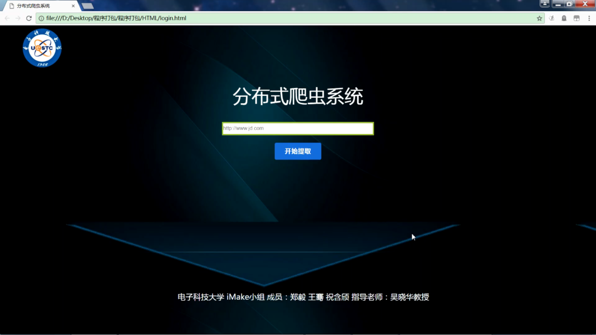

# cnsoftbei--iMake
使用指南：
1.先启动redis数据库-->server_main.py+spider_main.py-->login.html

2.开启程序前请保证redis中至少有一行以上数据。

3.本程序使用TCP通讯（爬虫模块），websocket通讯（浏览器--爬虫模块），PhantomJS/Chrome模拟浏览器行为。

文件结构如下：
```
│  requirements.txt
│  
├─code
│  │  ghostdriver.log
│  │  README.md
│  │  有关Tornado的一些问题.txt
│  │  项目使用说明
│  │  
│  ├─main_server
│  │  │  draw_picture.py
│  │  │  ghostdriver.log
│  │  │  lock.py
│  │  │  phantomjs.exe - 快捷方式.lnk
│  │  │  sender.py
│  │  │  server_main.py
│  │  │  tolnado_module.py
│  │  │  url_set.py
│  │  │  __init__.py
│  │  │  
│  │  ├─de_weight
│  │  │  │  de_weight.py
│  │  │  │  __init__.py
│  │  │  │  
│  │  │  └─__pycache__
│  │  │          de_weight.cpython-35.pyc
│  │  │          __init__.cpython-35.pyc
│  │  │          
│  │  ├─server_ip_and_port
│  │  │  │  draw_picture.py
│  │  │  │  lock.py
│  │  │  │  post_get_proxy.py
│  │  │  │  sending_ip_and_url.py
│  │  │  │  TCP_receiver.py
│  │  │  │  TCP_sender.py
│  │  │  │  __init__.py
│  │  │  │  
│  │  │  └─__pycache__
│  │  │          draw_picture.cpython-35.pyc
│  │  │          lock.cpython-35.pyc
│  │  │          post_get_proxy.cpython-35.pyc
│  │  │          sending_ip_and_url.cpython-35.pyc
│  │  │          TCP_receiver.cpython-35.pyc
│  │  │          TCP_sender.cpython-35.pyc
│  │  │          __init__.cpython-35.pyc
│  │  │          
│  │  ├─Tornado_Browser
│  │  │  │  parameter.py
│  │  │  │  Tornado_API.py
│  │  │  │  Tornado_listener.py
│  │  │  │  __init__.py
│  │  │  │  
│  │  │  └─__pycache__
│  │  │          main.cpython-35.pyc
│  │  │          parameter.cpython-35.pyc
│  │  │          Tornado_API.cpython-35.pyc
│  │  │          Tornado_listener.cpython-35.pyc
│  │  │          ttt.cpython-35.pyc
│  │  │          __init__.cpython-35.pyc
│  │  │          
│  │  └─__pycache__
│  │          draw_picture.cpython-35.pyc
│  │          lock.cpython-35.pyc
│  │          sender.cpython-35.pyc
│  │          server_main.cpython-35.pyc
│  │          temp.cpython-35.pyc
│  │          tolnado_module.cpython-35.pyc
│  │          url_set.cpython-35.pyc
│  │          __init__.cpython-35.pyc
│  │          
│  ├─redis_module
│  │  │  redis_store.py
│  │  │  __init__.py
│  │  │  
│  │  └─__pycache__
│  │          redis_store.cpython-35.pyc
│  │          __init__.cpython-35.pyc
│  │          
│  └─spider
│      │  1.py
│      │  2.py
│      │  create_driver.py
│      │  debug.log
│      │  ghostdriver.log
│      │  lock.py
│      │  phantomjs.exe
│      │  receiver.py
│      │  sender.py
│      │  spider_main.py
│      │  TEST_DATA.py
│      │  url_set.py
│      │  webdriver_change_proxy.py
│      │  
│      ├─de_weight
│      │  │  de_weight.py
│      │  │  __init__.py
│      │  │  
│      │  └─__pycache__
│      │          de_weight.cpython-35.pyc
│      │          __init__.cpython-35.pyc
│      │          
│      ├─spider_ip_and_port
│      │  │  check_proxy.py
│      │  │  lock.py
│      │  │  receiver.py
│      │  │  receiving_ip_and_port.py
│      │  │  TCP_sender.py
│      │  │  __init__.py
│      │  │  
│      │  └─__pycache__
│      │          check_proxy.cpython-35.pyc
│      │          receiving_ip_and_port.cpython-35.pyc
│      │          TCP_sender.cpython-35.pyc
│      │          __init__.cpython-35.pyc
│      │          
│      ├─Tornado_Browser
│      │  │  parameter.py
│      │  │  Tornado_API.py
│      │  │  Tornado_listener.py
│      │  │  __init__.py
│      │  │  
│      │  └─__pycache__
│      │          main.cpython-35.pyc
│      │          parameter.cpython-35.pyc
│      │          Tornado_API.cpython-35.pyc
│      │          Tornado_listener.cpython-35.pyc
│      │          ttt.cpython-35.pyc
│      │          __init__.cpython-35.pyc
│      │          
│      └─__pycache__
│              create_driver.cpython-35.pyc
│              lock.cpython-35.pyc
│              receiver.cpython-35.pyc
│              url_set.cpython-35.pyc
│              webdriver_change_proxy.cpython-35.pyc
│              
├─HTML
│  │  bar_chart.html
│  │  line_chart.html
│  │  login.html
│  │  mainpage.html
│  │  test2.html
│  │  text.html
│  │  
│  ├─css
│  │      mainpage.css
│  │      
│  ├─Echarts
│  │      echarts.js
│  │      echarts.min.js
│  │      infographic.js
│  │      vintage.js
│  │      
│  ├─img
│  │      1.jpg
│  │      2.jpg
│  │      3.png
│  │      bg.jpg
│  │      bg1.jpg
│  │      sc.png
│  │      school.png
│  │      title.png
│  │      title1.png
│  │      
│  └─js
│          getURL.js
│          test.js
│          
└─redis
    │  00-RELEASENOTES
    │  BUGS
    │  CONTRIBUTING
    │  COPYING
    │  README
    │  README-Windows.txt
    │  
    ├─32bit
    │      dump.rdb
    │      libhiredis.dll
    │      redis-benchmark.exe
    │      redis-check-aof.exe
    │      redis-check-dump.exe
    │      redis-cli.exe
    │      redis-server.exe
    │      redis.conf
    │      
    └─64bit
            dump.rdb
            libhiredis.dll
            redis-benchmark.exe
            redis-check-aof.exe
            redis-check-dump.exe
            redis-cli.exe
            redis-server.exe
            redis.conf
```
----------------------------------------------------------------------------

### 演示视频请点击:
<br>
<a href="https://v.youku.com/v_show/id_XMzAxNjE1MDc5Ng==.html?x&sharefrom=android&sharekey=0b4b370700bbf36df5eb7c752f5cae749"></a>

